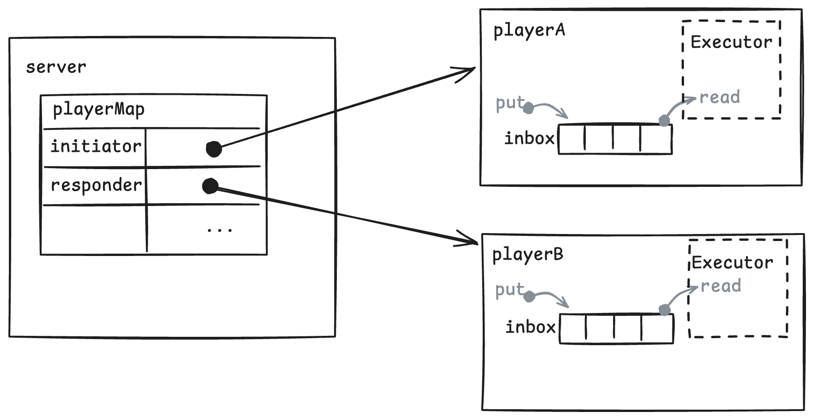
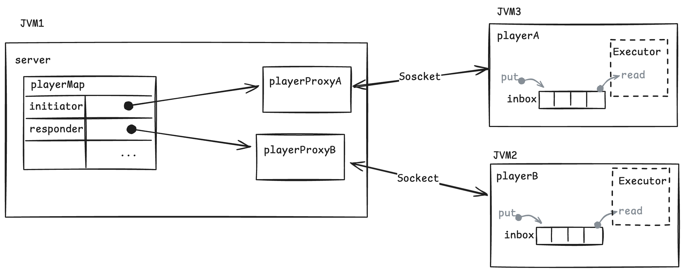

### Single Process Example
#### Design


#### Build the Project

First, compile the project:
```
mvn clean package

[INFO] Replacing original artifact with shaded artifact.
[INFO] Replacing /Users/jimwi/IdeaProjects/HelloTalk/target/HelloTalk-1.0-SNAPSHOT.jar with /Users/jimwi/IdeaProjects/HelloTalk/target/HelloTalk-1.0-SNAPSHOT-shaded.jar
[INFO] ------------------------------------------------------------------------
[INFO] BUILD SUCCESS
[INFO] ------------------------------------------------------------------------
[INFO] Total time:  1.441 s
[INFO] Finished at: 2025-09-15T20:54:40+02:00
[INFO] ------------------------------------------------------------------------
```

Run Single-Process Example
```
./single-start.sh         
=== Running Single ===
Talks start
initiator -> responder: hello_1
responder -> initiator: hello_1_1
initiator -> responder: hello_1_1_2
responder -> initiator: hello_1_1_2_2
initiator -> responder: hello_1_1_2_2_3
responder -> initiator: hello_1_1_2_2_3_3
initiator -> responder: hello_1_1_2_2_3_3_4
responder -> initiator: hello_1_1_2_2_3_3_4_4
initiator -> responder: hello_1_1_2_2_3_3_4_4_5
responder -> initiator: hello_1_1_2_2_3_3_4_4_5_5
initiator -> responder: hello_1_1_2_2_3_3_4_4_5_5_6
responder -> initiator: hello_1_1_2_2_3_3_4_4_5_5_6_6
initiator -> responder: hello_1_1_2_2_3_3_4_4_5_5_6_6_7
responder -> initiator: hello_1_1_2_2_3_3_4_4_5_5_6_6_7_7
initiator -> responder: hello_1_1_2_2_3_3_4_4_5_5_6_6_7_7_8
responder -> initiator: hello_1_1_2_2_3_3_4_4_5_5_6_6_7_7_8_8
initiator -> responder: hello_1_1_2_2_3_3_4_4_5_5_6_6_7_7_8_8_9
responder -> initiator: hello_1_1_2_2_3_3_4_4_5_5_6_6_7_7_8_8_9_9
initiator -> responder: hello_1_1_2_2_3_3_4_4_5_5_6_6_7_7_8_8_9_9_10
responder -> initiator: hello_1_1_2_2_3_3_4_4_5_5_6_6_7_7_8_8_9_9_10_10
Talks stopped
```

### Multi-Process Example
#### Design


#### Run Multi-Process Example

You need to open three terminals.

Terminal 1 — Run Server
```
./multi-start-server.sh                                            
=== Running StartServer ===
Server starts.
```
Terminal 2 — Run Responder Player
```
./multi-start-responder.sh                                         
=== Running StartResponder ===
Responder started.
```
Terminal 3 — Run Initiator Player
```
./multi-start-initiator.sh
=== Running StartInitiator ===
Initiator started.
send    ->: hello_1
receive <-: hello_1_1
send    ->: hello_1_1_2
receive <-: hello_1_1_2_2
send    ->: hello_1_1_2_2_3
receive <-: hello_1_1_2_2_3_3
send    ->: hello_1_1_2_2_3_3_4
receive <-: hello_1_1_2_2_3_3_4_4
send    ->: hello_1_1_2_2_3_3_4_4_5
receive <-: hello_1_1_2_2_3_3_4_4_5_5
send    ->: hello_1_1_2_2_3_3_4_4_5_5_6
receive <-: hello_1_1_2_2_3_3_4_4_5_5_6_6
send    ->: hello_1_1_2_2_3_3_4_4_5_5_6_6_7
receive <-: hello_1_1_2_2_3_3_4_4_5_5_6_6_7_7
send    ->: hello_1_1_2_2_3_3_4_4_5_5_6_6_7_7_8
receive <-: hello_1_1_2_2_3_3_4_4_5_5_6_6_7_7_8_8
send    ->: hello_1_1_2_2_3_3_4_4_5_5_6_6_7_7_8_8_9
receive <-: hello_1_1_2_2_3_3_4_4_5_5_6_6_7_7_8_8_9_9
send    ->: hello_1_1_2_2_3_3_4_4_5_5_6_6_7_7_8_8_9_9_10
receive <-: hello_1_1_2_2_3_3_4_4_5_5_6_6_7_7_8_8_9_9_10_10
Initiator stopped.
```
